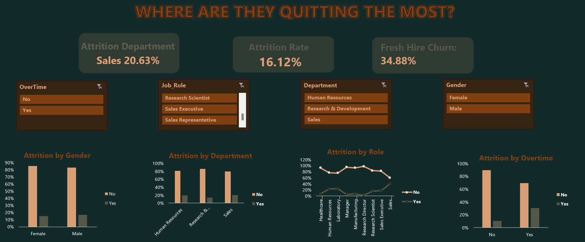

# Why They Left: An Excel Dashboard on Employee Attrition
This project explores employee attrition trends using *Excel* for data cleaning, and visualization.
*This is Part 1 of a 2 Part HR Analytics Series.*
Stay tuned for [*The Loyalty Blueprint*](#https://github.com/Shrey0561/Part-2-Why-They-Stay-Retention-Insight-Hub-SQL-Excel-) - The next chapter in decoding employee retention.

## Overview
Using a dataset of 1470 mock HR records, this project dives deep into:
 - Which departments face the highest attrition?
 - Which roles are most affected?
 - Are there gender or overtime-related patterns in employee turnover?
 - Which employee segments are most likely to leave?

## KPIs Tracked
 - *Total Attrition Count*
 - *Department with Highest Turnover*
 - *Most At-Risk Experience Level*

## Dashboard Preview
Here's a snapshot of the dashboard you'll find in this repo

## Insights Summary

### Departmental Trends
 - *Sales* had the highest attrition at *20.63%*, followed by *HR* at *19.05%*.
 - These trends suggest potential burnout, unclear growth paths, or compensation dissatisfaction in people-facing roles.

### Job Role Breakdown
 - *Sales Representatives* topped the charts with a massive *39.76%* attrition rate.
 - In contrast, *Research Directors* had only *2.5%* attrition, highlighting how seniority and role clarity may improve retention.

### Gender Gap
 - *Males:* 17.01% attrition
 - *Females:* 14.80% attrition
 - The gender gap isn't drastic but may reflect differences in job alignment or external opportunities.

### Overtime & Burnout
 - Drastically, *30.53* of those doing overtime left.
 - Even among employees not working overtime, *10.44%* still quit, pointing to other factors like culture or leadership quality.

### Income & Retention
 - *Low-income employees* had an attrition rate of *28.61%*, well above average.
 - This reinforces the need for equitable compensation structures, especially for frontline roles.

### Experience Matters
 - *Fresh hires*: 34.88% attrition
 - *Older hires*: 12.91% attrition
 - This suggests gaps in onboarding, mentorship, or role expectation setting for early-stage employees.

### Satisfaction Metrics
 - Attrition peaked at *31.25%* for employees rating Work-Life Balance as "1".
 - Even highly satisfied employees (rating "4") left, indicating retention is multi-dimensional, not just about satisfaction scores.

## Tools Used 
 - Microsoft Excel
   > Pivot Tables
   > Dashboard Design

## What I Would Do Next
If this were a real-world HR consulting project, I would explore: 
 - *Time-based trends* (monthly exits, tenure-based churn)
 - *Qualitative inputs* like exit interviews
 - Connecting data with employee engagement surveys for deeper insights.

## Let's Connect
I am always open to chat about data, analytics or new opportunitis! Feel free to reach out via:
 * GitHub (#https://github.com/Shrey0561)
 * LinkedIn (#https://www.linkedin.com/in/shreya-srinath-879a66205/)
Looking forward to collaborating and connecting!
